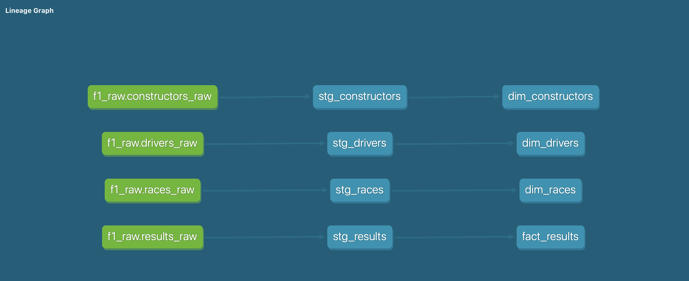

# 🏎️ Formula 1 Data Warehouse

An end-to-end data engineering project that ingests, models, and transforms historical Formula 1 data into an analytics-ready warehouse.

The project demonstrates modern data engineering and analytics engineering best practices, including robust ingestion, layered transformations, data quality testing, and star-schema modeling.

---

## Overview
This warehouse enables analysis of Formula 1 history such as:
- Driver career performance
- Constructor dominance by season
- Race and calendar analytics

The pipeline is designed to be **idempotent, resumable, and analytics-ready**, closely mirroring real-world production patterns.

---

## Tech Stack
- **Python** – API ingestion & orchestration
- **PostgreSQL** – relational warehouse (Dockerized)
- **Docker & Docker Compose** – local infrastructure
- **dbt** – transformations, testing, and modeling
- **SQL** – analytics & data modeling
- **Public Ergast API** (via `api.jolpi.ca` mirror)

---

## Architecture

### Ingestion
- Python ingestion scripts pull data from the Ergast F1 API
- Explicit handling of:
  - API pagination
  - Rate limits
  - Seasonal batch ingestion
- Pipelines are **idempotent** and safe to re-run

### Storage
- PostgreSQL running locally in Docker
- Schema-based separation:
  - `public` → raw ingested tables
  - `staging` → dbt staging views
  - `analytics` → analytics-ready marts

### Transformation
- dbt used to implement a layered transformation approach:
  - **Raw → Staging → Marts**
- Data quality enforced via dbt tests
- Star schema modeled for analytics consumption

### Orchestration
- Docker Compose orchestrates the full pipeline:
  - PostgreSQL initializes the warehouse
  - Ingestion container loads raw data
  - dbt container builds staging and analytics models
- dbt execution is automatically triggered after ingestion completes

---

## Data Model

### Raw Tables
- `drivers_raw`
- `constructors_raw`
- `races_raw`
- `results_raw`

### Staging Models (dbt)
- `stg_drivers`
- `stg_constructors`
- `stg_races`
- `stg_results`

### Analytics Marts
**Dimensions**
- `dim_drivers`
- `dim_constructors`
- `dim_races`

**Fact**
- `fact_results`  
  *(one row per driver per race)*

---

## Data Quality & Testing
- dbt tests implemented for:
  - `not_null`
  - `unique`
  - `relationships` (foreign key integrity)
- Ensures referential integrity between facts and dimensions

---

## Warehouse Schema



---

## Example Analytics
Example SQL analytics queries are available in `f1_dbt/analyses/`, including:
- Top drivers by career points
- Constructor dominance by season
- Driver win counts
- Race distribution by country

---

## How to Run Locally

### Prerequisites

Before running the project locally, ensure you have the following installed:

- **Git**
- **Docker & Docker Compose**
  - https://docs.docker.com/get-docker/


### ⏱️ Execution Time

Execution time depends primarily on API rate limits during ingestion.

Typical runtimes:
- **Full historical ingestion**: ~25–30 minutes  
  (~28,000 race result records)
- **dbt transformations & tests**: < 1 minute

The pipeline is idempotent and safe to re-run. Subsequent runs may complete faster if data already exists.

### 💾 Local Resource Usage (Approximate)

Docker resources used by the pipeline:

- **PostgreSQL data volume**: ~70 MB
- **Docker images**:
  - postgres: ~700 MB
  - dbt-postgres: ~900 MB
  - ingestion service: ~850 MB
- **Runtime memory usage**:
  - ~50–100 MB per container during execution

These resources are typical for a local analytics stack and can be fully cleaned up using:

```bash
docker compose down -v
```

### 1️⃣ Local Environment Setup

  Clone the repository

  ```bash
  git clone https://github.com/SebastianSwiczerewski/f1_data_warehouse.git
  cd f1_data_warehouse/
  ```

  Create a local .env file from the example provided. No edits required for local runs.

  ```bash
  cp .env.example .env
  ```

### 2️⃣ Run the Entire Pipeline
  The entire data pipeline is orchestrated through Docker Compose and can be executed with a **single command**.

  ```bash
  cd docker/
  docker compose --env-file ../.env up --build
  ```

  This command is the **core entry point** of the project. It provisions infrastructure, ingests data, and builds analytics models end-to-end with no manual intervention.

Under the hood, it performs the following steps:

1. **Provision the warehouse**
   - Starts a PostgreSQL container
   - Initializes schemas and persistent storage

2. **Ingest raw Formula 1 data**
   - Executes Python ingestion pipelines
   - Pulls historical data from the Ergast API
   - Handles pagination, retries, and API rate limits
   - Loads data into raw tables in the `public` schema

3. **Transform & validate data with dbt**
   - Builds staging models as views (`dbt_staging`)
   - Builds analytics-ready marts as tables (`dbt_analytics`)
   - Executes data quality tests:
     - `not null`
     - `unique`
     - `relationships`

Once this step completes successfully, the warehouse is **fully analytics-ready**.


### 3️⃣ Validation & Analytics

  ```bash
  cd docker/
  docker exec -it f1_postgres psql -U f1_user -d f1_raw
  ```
  
  List schemas:

  ```bash
  \dn                
  ```
  You should see the following schemas:

  - **public** → raw tables  
  - **dbt_staging** → staging views  
  - **dbt_analytics** → dimension & fact tables

  ```bash
  \dt public.*          # List of raw tables
  \dv dbt_staging.*     # List of staging views
  \dt dbt_analytics.*   # List of dimension & fact tables
  ```


  Other useful commands

  ```bash
  \dt                 # List tables
  \dv                 # List views
  \d table_name       # Describe table
  \q                  # Exit
  ```

  For example analytics queries using fact and dimension models check ./f1_dbt/analyses/f1_analytics.sql


### 4️⃣ Tear Down Local Environment

  Stop Docker services (keep data)

  ```bash
  docker compose down
  ```

  ⚠️ WARNING: This deletes data

  ```bash
  docker compose down -v
  ```


## Pipeline Summary

This project demonstrates a production-style ELT pipeline where:
- Infrastructure is fully containerized
- Ingestion and transformation are decoupled
- dbt enforces data quality and modeling standards
- The warehouse is immediately analytics-ready after a single command